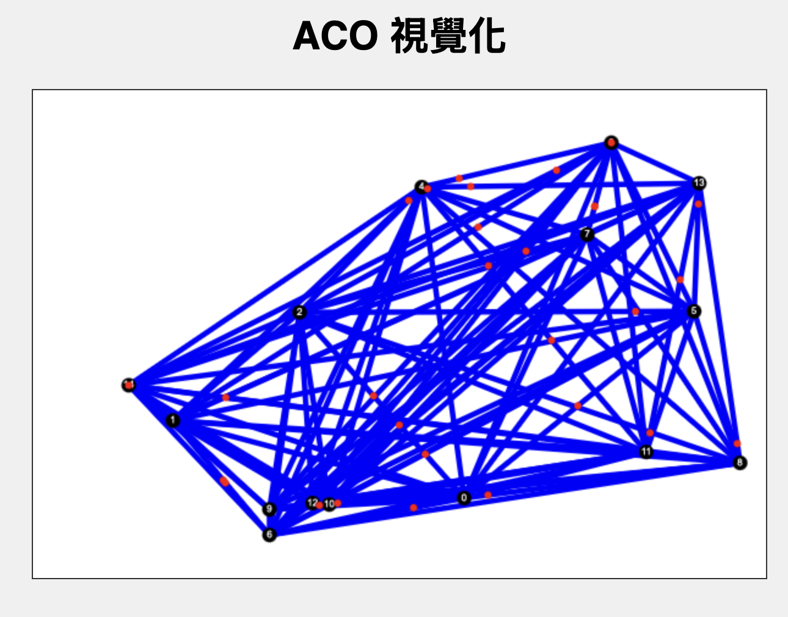
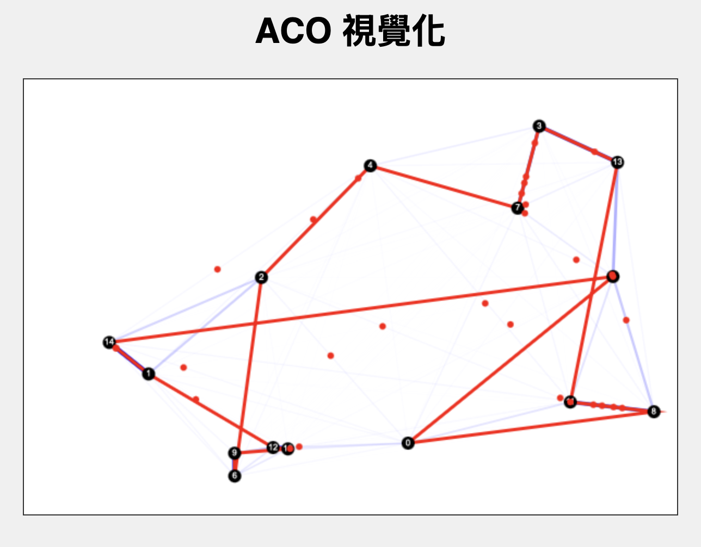

# ACO 視覺化

這是一個使用純 JavaScript、HTML 和 Canvas API 打造的蟻群演算法 (Ant Colony Optimization, ACO) 即時視覺化專案。

## 🚀 即時網站預覽 (Live Demo)

[**https://hsiu0308.github.io/ACO-Canvas-Simulator/**](https://hsiu0308.github.io/ACO-Canvas-Simulator/)

---

本專案旨在解決旅行商問題 (Traveling Salesman Problem, TSP)，並透過動畫展示演算法的運作過程：

- **螞蟻模擬：** 每隻螞蟻都是一個獨立的紅點，您可以看到牠們在城市之間移動。
- **費洛蒙路徑：** 螞蟻走過的路徑會留下費洛蒙（藍色線條），路徑會隨著費洛蒙濃度變粗、變不透明。
- **最佳路徑：** 演算法目前找到的最短路徑會以一條鮮紅色的線條標示。

_(上圖顯示了演算法的初始狀態)_

_(上圖顯示了第一代運算後的結果)_

## ✨ 功能特色

- **即時模擬：** 數十隻螞蟻 (`Ant` 物件) 獨立運作，即時更新牠們的位置與狀態。
- **動態視覺化：** 費洛蒙路徑和當前最佳路徑會隨著每一代 (generation) 的演進而動態更新。
- **互動式介面：** 可透過 UI 側邊欄即時調整所有演算法參數，包含螞蟻數量、城市數量、Alpha、Beta、揮發率和螞蟻速度。
- **模擬控制：** 包含「重新開始」和「暫停/繼續」功能，讓使用者能隨時中斷、觀察或重置模擬。
- **即時數據：** 直接在畫布左上角顯示目前的「世代」和「最佳路徑長度」。
- **無需函式庫：** 100% 純 JavaScript，不依賴任何外部函式庫。

## 🚀 如何使用

本專案無需任何編譯或打包過程。

1.  下載 `index.html`, `style.css`, 和 `main.js` 這三個檔案。
2.  將這三個檔案放在同一個資料夾中。
3.  用任何現代網頁瀏覽器打開 `index.html` 檔案即可。

## 🔬 程式碼結構

- **`index.html`**
  - 提供 HTML 骨架，包含 `<canvas>` 元素和 `div#controls` 控制面板。
  - 建構所有 `input[type=range]` 拉桿和 `button` 按鈕。
- **`style.css`**
  - 提供頁面美化，使用 Flexbox 佈局將畫布和控制面板並排。
  - 包含按鈕的 `paused` 狀態樣式。
- **`main.js`**
  - **DOM 處理**：獲取所有 DOM 元素，並為拉桿和按鈕綁定 `addEventListener`。
  - **控制函式**：
    - `updateConfigFromUI()`：從 UI 拉桿讀取值並更新 `config` 物件。
    - `restartSimulation()`：重置所有變數、清除畫布並呼叫 `setup()` 來重新開始。
    - `togglePause()`：切換 `isPaused` 標記，並控制 `mainLoop` 的啟動與停止。
  - **`class Ant`**：核心類別，管理每隻螞蟻的狀態、移動邏輯 (`update()`) 和路徑選擇 (`selectNextCity()`)。
  - **`setup()`**：初始化函式。負責產生城市、計算距離矩陣、建立 `Ant` 物件。
  - **`mainLoop()`**：主要的動畫迴圈 (使用 `requestAnimationFrame`)。現在包含 `isPaused` 檢查。
  - **世代管理**：當 `allAntsFinished` 為 `true` 時，觸發 `updatePheromones()` 和 `ant.reset()`。
  - **演算法函式**：
    - `calculateProbs()`：計算螞蟻下一步的機率。
    - `updatePheromones()`：處理費洛蒙的揮發與放置。
  - **繪圖函式**：
    - `drawPheromones()`、`drawBestPath()`、`drawCities()`：繪製演算法的各個視覺元件。
    - `drawInfo()`：在畫布上繪製世代和路徑長度資訊。
